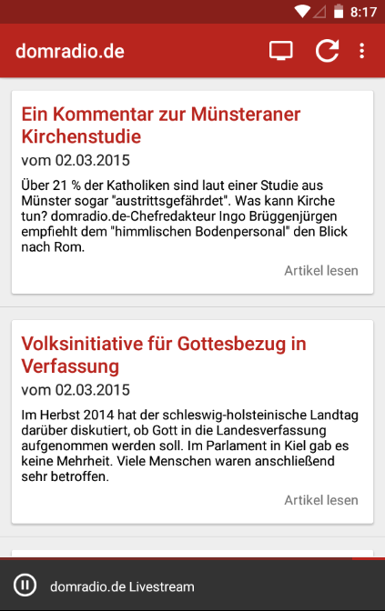

# domradio

Android domradio.de App 

Used Libraries
--------------

* PkRSS - https://github.com/Pkmmte/PkRSS
* Material Dialogs - https://github.com/afollestad/material-dialogs
* MaterialDesignLibrary - https://github.com/navasmdc/MaterialDesignLibrary
* EventBus - https://github.com/greenrobot/EventBus
